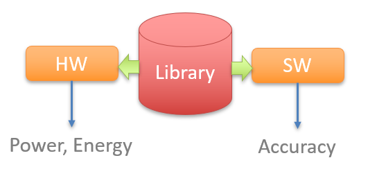

# Approx-FPGAs
###### library of approximate arithmetic circuits optimized for FPGAs
This is a GitHub repository of subset of EvoApproxLib optimized for FPGAs . The library consists of hardware and software models of approximate circuits that are designed to be easily used in arbitrary application. Web-based GUI and the full version of EvoApproxLib can be found on [our websites](https://ehw.fit.vutbr.cz/evoapprox)



## Reference
This library is licenced under [MIT licence](LICENSE.md). If you use the library in your research, please refer the following paper:

PRABAKARAN B. S., MRAZEK V., VASICEK Z., SEKANINA L., SHAFIQUE M. ApproxFPGAs: Embracing ASIC-based Approximate Arithmetic Components for FPGA-Based Systems. The 57th Annual Design Automation Conference 2020 (DAC '20), 2020.

```bibtex
@INPROCEEDINGS{approxfpgas,
    author = "Bharath S. Prabakaran and Vojtech Mrazek and Zdenek Vasicek and Lukas Sekanina and Muhammad Shafique",
    title = "ApproxFPGAs: Embracing ASIC-based Approximate Arithmetic Components for FPGA-Based Systems",
    booktitle = "The 57th Annual Design Automation Conference 2020 (DAC '20)",
    publisher = "Association for Computing Machinery",
    volume={},
    number={},
    pages={6},
    }
```


## Usage in Python
To use the models from Python, it is possible to generate and compile binary extensions using cython.


1. Make sure cython is installed
```bash
pip install --user cython
```

2. Generate cython sources (creates `cython` directory):
```bash
python3 make_cython.py
```

3. Compile and install binary extensions (`*.so` on linux, `*.pyd` on Windows):
```bash
cd cython
python3 setup.py build_ext
python3 setup.py install --user
```

4. Finally, the extension can be used in a Python script as follows:
```python
import approxfpga as eal

e = 0
for i in range(0, 2**8):
    for j in range(0, 2**8):
        e += abs(eal.add8u_04A.calc(i, j) - (i+j))

print('MAE calculated', e / (2**(2*8)))
print('MAE from lib', eal.add8u_04A.MAE)
```

## Circuits
### Multipliers (unsigned)
 - 8-bit unsigned multipliers
   - [Pareto optimal sub-set wrt. med and power parameters](mul8x8/fpga_power_mae/README.md) - 10 circuits
   - [Pareto optimal sub-set wrt. med and latency parameters](mul8x8/fpga_delay_mae/README.md) - 9 circuits
   - [Pareto optimal sub-set wrt. med and # luts parameters](mul8x8/fpga_lut_mae/README.md) - 10 circuits
   - [Pareto optimal sub-set wrt. wced and power parameters](mul8x8/fpga_power_wce/README.md) - 10 circuits
   - [Pareto optimal sub-set wrt. wced and latency parameters](mul8x8/fpga_delay_wce/README.md) - 8 circuits
   - [Pareto optimal sub-set wrt. wced and # luts parameters](mul8x8/fpga_lut_wce/README.md) - 10 circuits
 - 12-bit unsigned multipliers
   - [Pareto optimal sub-set wrt. med and power parameters](mul12x12/fpga_power_mae/README.md) - 10 circuits
   - [Pareto optimal sub-set wrt. med and latency parameters](mul12x12/fpga_delay_mae/README.md) - 9 circuits
   - [Pareto optimal sub-set wrt. med and # luts parameters](mul12x12/fpga_lut_mae/README.md) - 9 circuits
   - [Pareto optimal sub-set wrt. wced and power parameters](mul12x12/fpga_power_wce/README.md) - 10 circuits
   - [Pareto optimal sub-set wrt. wced and latency parameters](mul12x12/fpga_delay_wce/README.md) - 9 circuits
   - [Pareto optimal sub-set wrt. wced and # luts parameters](mul12x12/fpga_lut_wce/README.md) - 10 circuits
 - 16-bit unsigned multipliers
   - [Pareto optimal sub-set wrt. med and power parameters](mul16x16/fpga_power_mae/README.md) - 9 circuits
   - [Pareto optimal sub-set wrt. med and latency parameters](mul16x16/fpga_delay_mae/README.md) - 10 circuits
   - [Pareto optimal sub-set wrt. med and # luts parameters](mul16x16/fpga_lut_mae/README.md) - 10 circuits
   - [Pareto optimal sub-set wrt. wced and power parameters](mul16x16/fpga_power_wce/README.md) - 9 circuits
   - [Pareto optimal sub-set wrt. wced and latency parameters](mul16x16/fpga_delay_wce/README.md) - 9 circuits
   - [Pareto optimal sub-set wrt. wced and # luts parameters](mul16x16/fpga_lut_wce/README.md) - 10 circuits
### Adders (unsigned)
 - 8-bit unsigned adders
   - [Pareto optimal sub-set wrt. med and power parameters](add8u/fpga_power_mae/README.md) - 10 circuits
   - [Pareto optimal sub-set wrt. med and latency parameters](add8u/fpga_delay_mae/README.md) - 9 circuits
   - [Pareto optimal sub-set wrt. med and # luts parameters](add8u/fpga_lut_mae/README.md) - 8 circuits
   - [Pareto optimal sub-set wrt. wced and power parameters](add8u/fpga_power_wce/README.md) - 9 circuits
   - [Pareto optimal sub-set wrt. wced and latency parameters](add8u/fpga_delay_wce/README.md) - 9 circuits
   - [Pareto optimal sub-set wrt. wced and # luts parameters](add8u/fpga_lut_wce/README.md) - 9 circuits
 - 12-bit unsigned adders
   - [Pareto optimal sub-set wrt. med and power parameters](add12u/fpga_power_mae/README.md) - 9 circuits
   - [Pareto optimal sub-set wrt. med and latency parameters](add12u/fpga_delay_mae/README.md) - 9 circuits
   - [Pareto optimal sub-set wrt. med and # luts parameters](add12u/fpga_lut_mae/README.md) - 10 circuits
   - [Pareto optimal sub-set wrt. wced and power parameters](add12u/fpga_power_wce/README.md) - 10 circuits
   - [Pareto optimal sub-set wrt. wced and latency parameters](add12u/fpga_delay_wce/README.md) - 9 circuits
   - [Pareto optimal sub-set wrt. wced and # luts parameters](add12u/fpga_lut_wce/README.md) - 10 circuits
 - 16-bit unsigned adders
   - [Pareto optimal sub-set wrt. med and power parameters](add16u/fpga_power_mae/README.md) - 9 circuits
   - [Pareto optimal sub-set wrt. med and latency parameters](add16u/fpga_delay_mae/README.md) - 9 circuits
   - [Pareto optimal sub-set wrt. med and # luts parameters](add16u/fpga_lut_mae/README.md) - 9 circuits
   - [Pareto optimal sub-set wrt. wced and power parameters](add16u/fpga_power_wce/README.md) - 9 circuits
   - [Pareto optimal sub-set wrt. wced and latency parameters](add16u/fpga_delay_wce/README.md) - 8 circuits
   - [Pareto optimal sub-set wrt. wced and # luts parameters](add16u/fpga_lut_wce/README.md) - 8 circuits
