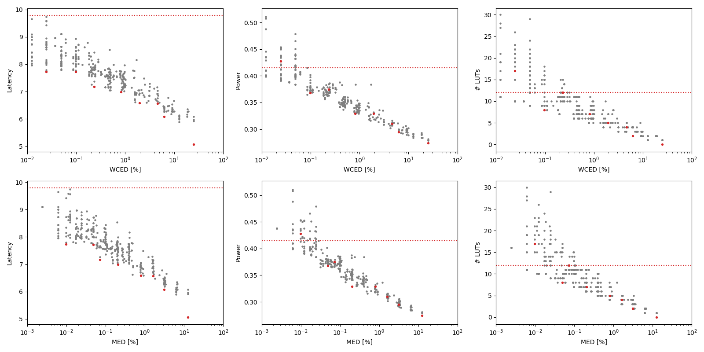

Selected circuits
===================
 - **Circuit**: 12-bit unsigned adders
 - **Selection criteria**: pareto optimal sub-set wrt. WCED [%] and Latency parameters

Parameters of selected circuits
----------------------------

| Circuit name | MAE% | WCE% | EP% | MRE% | MSE | PowerW | Delayns | LUTs | Download |
| --- |  --- | --- | --- | --- | --- | --- | --- | --- | --- |
| add12u_0NB | 0.00 | 0.00 | 0.00 | 0.00 | 0 | 0.42 | 9.8 | 12 |  [[Verilog](add12u_0NB.v)] [[VerilogPDK45](add12u_0NB_pdk45.v)] [[C](add12u_0NB.c)] |
| add12u_1C0 | 0.0098 | 0.024 | 62.50 | 0.026 | 1.0 | 0.43 | 7.7 | 17 |  [[Verilog](add12u_1C0.v)] [[VerilogPDK45](add12u_1C0_pdk45.v)] [[C](add12u_1C0.c)] |
| add12u_0LB | 0.049 | 0.098 | 96.88 | 0.14 | 21 | 0.37 | 7.7 | 8.0 |  [[Verilog](add12u_0LB.v)] [[VerilogPDK45](add12u_0LB_pdk45.v)] [[C](add12u_0LB.c)] |
| add12u_3AF | 0.072 | 0.23 | 94.73 | 0.20 | 53 | 0.38 | 7.2 | 12 |  [[Verilog](add12u_3AF.v)] [[VerilogPDK45](add12u_3AF_pdk45.v)] [[C](add12u_3AF.c)] |
| add12u_013 | 0.21 | 0.82 | 97.84 | 0.58 | 474 | 0.33 | 7.0 | 7.0 |  [[Verilog](add12u_013.v)] [[VerilogPDK45](add12u_013_pdk45.v)] [[C](add12u_013.c)] |
| add12u_0EJ | 0.80 | 1.94 | 99.62 | 2.20 | 5710 | 0.33 | 6.6 | 5.0 |  [[Verilog](add12u_0EJ.v)] [[VerilogPDK45](add12u_0EJ_pdk45.v)] [[C](add12u_0EJ.c)] |
| add12u_0AH | 1.62 | 4.59 | 99.80 | 4.53 | 24416 | 0.31 | 6.6 | 4.0 |  [[Verilog](add12u_0AH.v)] [[VerilogPDK45](add12u_0AH_pdk45.v)] [[C](add12u_0AH.c)] |
| add12u_0MC | 3.12 | 6.25 | 100.00 | 8.37 | 85092 | 0.29 | 6.1 | 2.0 |  [[Verilog](add12u_0MC.v)] [[VerilogPDK45](add12u_0MC_pdk45.v)] [[C](add12u_0MC.c)] |
| add12u_1JB | 12.50 | 25.00 | 100.00 | 30.48 | 13286.96e2 | 0.27 | 5.1 | 0 |  [[Verilog](add12u_1JB.v)] [[VerilogPDK45](add12u_1JB_pdk45.v)] [[C](add12u_1JB.c)] |
    
Parameters
--------------

References
--------------
PRABAKARAN B. S., MRAZEK V., VASICEK Z., SEKANINA L., SHAFIQUE M. ApproxFPGAs: Embracing ASIC-based Approximate Arithmetic Components for FPGA-Based Systems. DAC 2020.

             