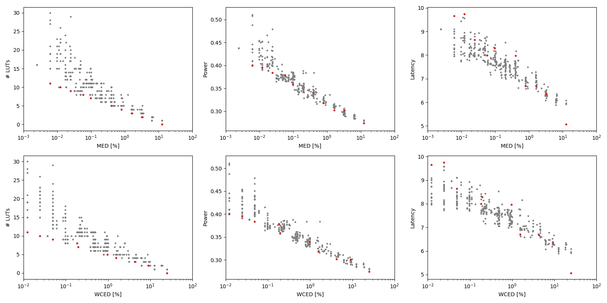

Selected circuits
===================
 - **Circuit**: 12-bit unsigned adders
 - **Selection criteria**: pareto optimal sub-set wrt. MED [%] and # LUTs parameters

Parameters of selected circuits
----------------------------

| Circuit name | MAE% | WCE% | EP% | MRE% | MSE | PowerW | Delayns | LUTs | Download |
| --- |  --- | --- | --- | --- | --- | --- | --- | --- | --- |
| add12u_0JB | 0.0061 | 0.012 | 50.00 | 0.017 | 0.5 | 0.4 | 9.7 | 11 |  [[Verilog](add12u_0JB.v)] [[VerilogPDK45](add12u_0JB_pdk45.v)] [[C](add12u_0JB.c)] |
| add12u_074 | 0.012 | 0.024 | 75.00 | 0.034 | 1.5 | 0.4 | 9.7 | 10 |  [[Verilog](add12u_074.v)] [[VerilogPDK45](add12u_074_pdk45.v)] [[C](add12u_074.c)] |
| add12u_0M4 | 0.024 | 0.049 | 87.50 | 0.068 | 5.5 | 0.38 | 8.6 | 9.0 |  [[Verilog](add12u_0M4.v)] [[VerilogPDK45](add12u_0M4_pdk45.v)] [[C](add12u_0M4.c)] |
| add12u_01V | 0.057 | 0.18 | 93.85 | 0.16 | 32 | 0.38 | 8.0 | 8.0 |  [[Verilog](add12u_01V.v)] [[VerilogPDK45](add12u_01V_pdk45.v)] [[C](add12u_01V.c)] |
| add12u_0M8 | 0.098 | 0.20 | 99.22 | 0.27 | 76 | 0.36 | 8.3 | 7.0 |  [[Verilog](add12u_0M8.v)] [[VerilogPDK45](add12u_0M8_pdk45.v)] [[C](add12u_0M8.c)] |
| add12u_0GX | 0.40 | 0.96 | 99.28 | 1.11 | 1448 | 0.34 | 8.0 | 5.0 |  [[Verilog](add12u_0GX.v)] [[VerilogPDK45](add12u_0GX_pdk45.v)] [[C](add12u_0GX.c)] |
| add12u_0KY | 0.78 | 1.56 | 99.95 | 2.15 | 4968 | 0.32 | 6.7 | 4.0 |  [[Verilog](add12u_0KY.v)] [[VerilogPDK45](add12u_0KY_pdk45.v)] [[C](add12u_0KY.c)] |
| add12u_0FQ | 1.63 | 4.26 | 99.82 | 4.51 | 24520 | 0.3 | 6.7 | 3.0 |  [[Verilog](add12u_0FQ.v)] [[VerilogPDK45](add12u_0FQ_pdk45.v)] [[C](add12u_0FQ.c)] |
| add12u_00J | 3.25 | 9.11 | 99.91 | 9.07 | 97656 | 0.3 | 6.3 | 2.0 |  [[Verilog](add12u_00J.v)] [[VerilogPDK45](add12u_00J_pdk45.v)] [[C](add12u_00J.c)] |
| add12u_1JB | 12.50 | 25.00 | 100.00 | 30.48 | 13286.96e2 | 0.27 | 5.1 | 0 |  [[Verilog](add12u_1JB.v)] [[VerilogPDK45](add12u_1JB_pdk45.v)] [[C](add12u_1JB.c)] |
    
Parameters
--------------

References
--------------
PRABAKARAN B. S., MRAZEK V., VASICEK Z., SEKANINA L., SHAFIQUE M. ApproxFPGAs: Embracing ASIC-based Approximate Arithmetic Components for FPGA-Based Systems. DAC 2020.

             