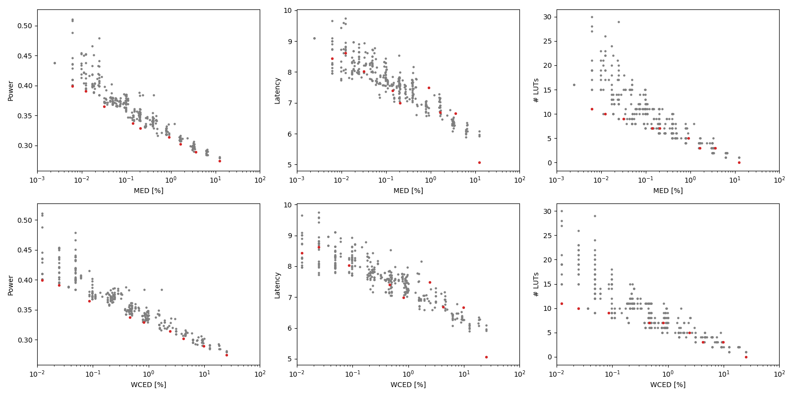

Selected circuits
===================
 - **Circuit**: 12-bit unsigned adders
 - **Selection criteria**: pareto optimal sub-set wrt. MED [%] and Power parameters

Parameters of selected circuits
----------------------------

| Circuit name | MAE% | WCE% | EP% | MRE% | MSE | PowerW | Delayns | LUTs | Download |
| --- |  --- | --- | --- | --- | --- | --- | --- | --- | --- |
| add12u_0L2 | 0.0061 | 0.012 | 50.00 | 0.017 | 0.5 | 0.4 | 8.4 | 11 |  [[Verilog](add12u_0L2.v)] [[VerilogPDK45](add12u_0L2_pdk45.v)] [[C](add12u_0L2.c)] |
| add12u_0NK | 0.012 | 0.024 | 75.00 | 0.034 | 1.5 | 0.39 | 8.6 | 10 |  [[Verilog](add12u_0NK.v)] [[VerilogPDK45](add12u_0NK_pdk45.v)] [[C](add12u_0NK.c)] |
| add12u_16V | 0.032 | 0.085 | 87.50 | 0.089 | 10 | 0.36 | 8.0 | 9.0 |  [[Verilog](add12u_16V.v)] [[VerilogPDK45](add12u_16V_pdk45.v)] [[C](add12u_16V.c)] |
| add12u_1KS | 0.14 | 0.46 | 97.31 | 0.39 | 195 | 0.34 | 7.4 | 7.0 |  [[Verilog](add12u_1KS.v)] [[VerilogPDK45](add12u_1KS_pdk45.v)] [[C](add12u_1KS.c)] |
| add12u_013 | 0.21 | 0.82 | 97.84 | 0.58 | 474 | 0.33 | 7.0 | 7.0 |  [[Verilog](add12u_013.v)] [[VerilogPDK45](add12u_013_pdk45.v)] [[C](add12u_013.c)] |
| add12u_1DY | 0.91 | 2.40 | 99.61 | 2.53 | 8172 | 0.31 | 7.5 | 5.0 |  [[Verilog](add12u_1DY.v)] [[VerilogPDK45](add12u_1DY_pdk45.v)] [[C](add12u_1DY.c)] |
| add12u_0FQ | 1.63 | 4.26 | 99.82 | 4.51 | 24520 | 0.3 | 6.7 | 3.0 |  [[Verilog](add12u_0FQ.v)] [[VerilogPDK45](add12u_0FQ_pdk45.v)] [[C](add12u_0FQ.c)] |
| add12u_2KL | 3.59 | 9.83 | 99.90 | 10.05 | 126206 | 0.29 | 6.7 | 3.0 |  [[Verilog](add12u_2KL.v)] [[VerilogPDK45](add12u_2KL_pdk45.v)] [[C](add12u_2KL.c)] |
| add12u_1JB | 12.50 | 25.00 | 100.00 | 30.48 | 13286.96e2 | 0.27 | 5.1 | 0 |  [[Verilog](add12u_1JB.v)] [[VerilogPDK45](add12u_1JB_pdk45.v)] [[C](add12u_1JB.c)] |
    
Parameters
--------------

References
--------------
PRABAKARAN B. S., MRAZEK V., VASICEK Z., SEKANINA L., SHAFIQUE M. ApproxFPGAs: Embracing ASIC-based Approximate Arithmetic Components for FPGA-Based Systems. DAC 2020.

             