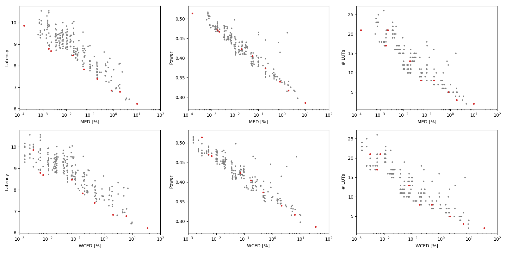

Selected circuits
===================
 - **Circuit**: 16-bit unsigned adders
 - **Selection criteria**: pareto optimal sub-set wrt. MED [%] and Latency parameters

Parameters of selected circuits
----------------------------

| Circuit name | MAE% | WCE% | EP% | MRE% | MSE | PowerW | Delayns | LUTs | Download |
| --- |  --- | --- | --- | --- | --- | --- | --- | --- | --- |
| add16u_0AR | 0.00015 | 0.0031 | 6.25 | 0.00053 | 1.0 | 0.51 | 9.9 | 21 |  [[Verilog](add16u_0AR.v)] [[VerilogPDK45](add16u_0AR_pdk45.v)] [[C](add16u_0AR.c)] |
| add16u_03X | 0.0018 | 0.0053 | 87.50 | 0.0049 | 8.0 | 0.47 | 8.8 | 17 |  [[Verilog](add16u_03X.v)] [[VerilogPDK45](add16u_03X_pdk45.v)] [[C](add16u_03X.c)] |
| add16u_0P5 | 0.0021 | 0.0069 | 89.45 | 0.006 | 12 | 0.47 | 8.7 | 21 |  [[Verilog](add16u_0P5.v)] [[VerilogPDK45](add16u_0P5_pdk45.v)] [[C](add16u_0P5.c)] |
| add16u_074 | 0.019 | 0.072 | 98.74 | 0.05 | 897 | 0.42 | 8.5 | 13 |  [[Verilog](add16u_074.v)] [[VerilogPDK45](add16u_074_pdk45.v)] [[C](add16u_074.c)] |
| add16u_00B | 0.055 | 0.17 | 99.61 | 0.15 | 7664 | 0.4 | 7.8 | 8.0 |  [[Verilog](add16u_00B.v)] [[VerilogPDK45](add16u_00B_pdk45.v)] [[C](add16u_00B.c)] |
| add16u_02Y | 0.20 | 0.46 | 99.95 | 0.55 | 83236 | 0.37 | 7.4 | 8.0 |  [[Verilog](add16u_02Y.v)] [[VerilogPDK45](add16u_02Y_pdk45.v)] [[C](add16u_02Y.c)] |
| add16u_06U | 0.82 | 2.09 | 99.98 | 2.26 | 15742.73e2 | 0.34 | 6.8 | 5.0 |  [[Verilog](add16u_06U.v)] [[VerilogPDK45](add16u_06U_pdk45.v)] [[C](add16u_06U.c)] |
| add16u_0LT | 1.87 | 6.19 | 99.99 | 5.21 | 89278.596e2 | 0.32 | 6.8 | 3.0 |  [[Verilog](add16u_0LT.v)] [[VerilogPDK45](add16u_0LT_pdk45.v)] [[C](add16u_0LT.c)] |
| add16u_0MH | 9.90 | 34.18 | 100.00 | 22.35 | 25358.103e4 | 0.29 | 6.2 | 2.0 |  [[Verilog](add16u_0MH.v)] [[VerilogPDK45](add16u_0MH_pdk45.v)] [[C](add16u_0MH.c)] |
    
Parameters
--------------

References
--------------
PRABAKARAN B. S., MRAZEK V., VASICEK Z., SEKANINA L., SHAFIQUE M. ApproxFPGAs: Embracing ASIC-based Approximate Arithmetic Components for FPGA-Based Systems. DAC 2020.

             