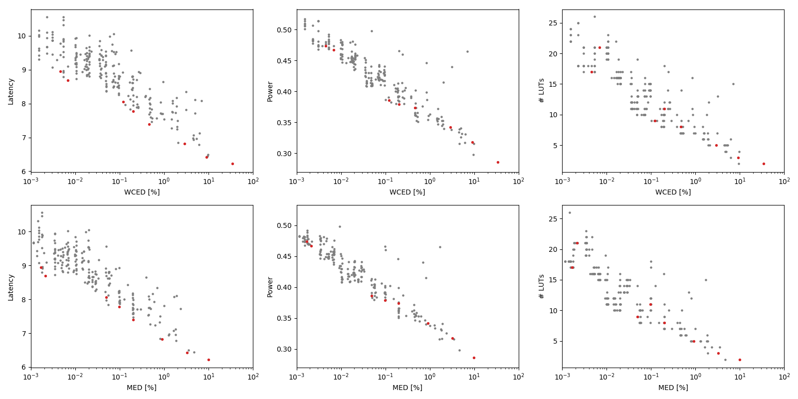

Selected circuits
===================
 - **Circuit**: 16-bit unsigned adders
 - **Selection criteria**: pareto optimal sub-set wrt. WCED [%] and Latency parameters

Parameters of selected circuits
----------------------------

| Circuit name | MAE% | WCE% | EP% | MRE% | MSE | PowerW | Delayns | LUTs | Download |
| --- |  --- | --- | --- | --- | --- | --- | --- | --- | --- |
| add16u_04Z | 0.0017 | 0.0046 | 87.50 | 0.0046 | 7.0 | 0.47 | 8.9 | 17 |  [[Verilog](add16u_04Z.v)] [[VerilogPDK45](add16u_04Z_pdk45.v)] [[C](add16u_04Z.c)] |
| add16u_0P5 | 0.0021 | 0.0069 | 89.45 | 0.006 | 12 | 0.47 | 8.7 | 21 |  [[Verilog](add16u_0P5.v)] [[VerilogPDK45](add16u_0P5_pdk45.v)] [[C](add16u_0P5.c)] |
| add16u_0EX | 0.049 | 0.12 | 99.61 | 0.14 | 5645 | 0.39 | 8.1 | 9.0 |  [[Verilog](add16u_0EX.v)] [[VerilogPDK45](add16u_0EX_pdk45.v)] [[C](add16u_0EX.c)] |
| add16u_0ML | 0.098 | 0.20 | 99.80 | 0.27 | 21856 | 0.38 | 7.8 | 11 |  [[Verilog](add16u_0ML.v)] [[VerilogPDK45](add16u_0ML_pdk45.v)] [[C](add16u_0ML.c)] |
| add16u_02Y | 0.20 | 0.46 | 99.95 | 0.55 | 83236 | 0.37 | 7.4 | 8.0 |  [[Verilog](add16u_02Y.v)] [[VerilogPDK45](add16u_02Y_pdk45.v)] [[C](add16u_02Y.c)] |
| add16u_0GK | 0.91 | 2.90 | 99.98 | 2.49 | 20515.545e2 | 0.34 | 6.8 | 5.0 |  [[Verilog](add16u_0GK.v)] [[VerilogPDK45](add16u_0GK_pdk45.v)] [[C](add16u_0GK.c)] |
| add16u_0K9 | 3.24 | 9.06 | 99.99 | 8.89 | 24918.624e3 | 0.32 | 6.4 | 3.0 |  [[Verilog](add16u_0K9.v)] [[VerilogPDK45](add16u_0K9_pdk45.v)] [[C](add16u_0K9.c)] |
| add16u_0MH | 9.90 | 34.18 | 100.00 | 22.35 | 25358.103e4 | 0.29 | 6.2 | 2.0 |  [[Verilog](add16u_0MH.v)] [[VerilogPDK45](add16u_0MH_pdk45.v)] [[C](add16u_0MH.c)] |
    
Parameters
--------------

References
--------------
PRABAKARAN B. S., MRAZEK V., VASICEK Z., SEKANINA L., SHAFIQUE M. ApproxFPGAs: Embracing ASIC-based Approximate Arithmetic Components for FPGA-Based Systems. DAC 2020.

             