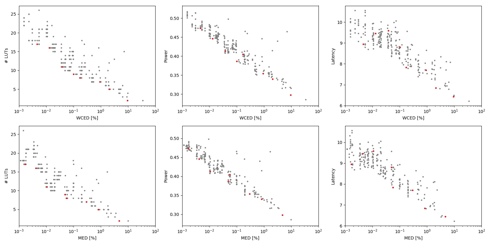

Selected circuits
===================
 - **Circuit**: 16-bit unsigned adders
 - **Selection criteria**: pareto optimal sub-set wrt. WCED [%] and # LUTs parameters

Parameters of selected circuits
----------------------------

| Circuit name | MAE% | WCE% | EP% | MRE% | MSE | PowerW | Delayns | LUTs | Download |
| --- |  --- | --- | --- | --- | --- | --- | --- | --- | --- |
| add16u_04Z | 0.0017 | 0.0046 | 87.50 | 0.0046 | 7.0 | 0.47 | 8.9 | 17 |  [[Verilog](add16u_04Z.v)] [[VerilogPDK45](add16u_04Z_pdk45.v)] [[C](add16u_04Z.c)] |
| add16u_02N | 0.0042 | 0.013 | 94.36 | 0.012 | 46 | 0.45 | 9.5 | 16 |  [[Verilog](add16u_02N.v)] [[VerilogPDK45](add16u_02N_pdk45.v)] [[C](add16u_02N.c)] |
| add16u_03D | 0.011 | 0.038 | 97.78 | 0.029 | 293 | 0.41 | 9.6 | 11 |  [[Verilog](add16u_03D.v)] [[VerilogPDK45](add16u_03D_pdk45.v)] [[C](add16u_03D.c)] |
| add16u_030 | 0.049 | 0.10 | 99.81 | 0.14 | 4956 | 0.39 | 8.8 | 9.0 |  [[Verilog](add16u_030.v)] [[VerilogPDK45](add16u_030_pdk45.v)] [[C](add16u_030.c)] |
| add16u_00B | 0.055 | 0.17 | 99.61 | 0.15 | 7664 | 0.4 | 7.8 | 8.0 |  [[Verilog](add16u_00B.v)] [[VerilogPDK45](add16u_00B_pdk45.v)] [[C](add16u_00B.c)] |
| add16u_00G | 0.29 | 0.92 | 99.92 | 0.82 | 222640 | 0.35 | 7.7 | 7.0 |  [[Verilog](add16u_00G.v)] [[VerilogPDK45](add16u_00G_pdk45.v)] [[C](add16u_00G.c)] |
| add16u_06U | 0.82 | 2.09 | 99.98 | 2.26 | 15742.73e2 | 0.34 | 6.8 | 5.0 |  [[Verilog](add16u_06U.v)] [[VerilogPDK45](add16u_06U_pdk45.v)] [[C](add16u_06U.c)] |
| add16u_0KC | 4.69 | 9.49 | 100.00 | 12.64 | 43382.861e3 | 0.3 | 6.4 | 2.0 |  [[Verilog](add16u_0KC.v)] [[VerilogPDK45](add16u_0KC_pdk45.v)] [[C](add16u_0KC.c)] |
    
Parameters
--------------

References
--------------
PRABAKARAN B. S., MRAZEK V., VASICEK Z., SEKANINA L., SHAFIQUE M. ApproxFPGAs: Embracing ASIC-based Approximate Arithmetic Components for FPGA-Based Systems. DAC 2020.

             