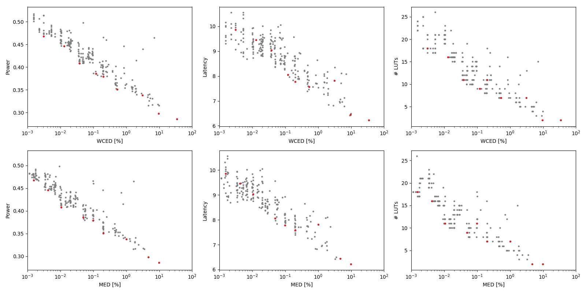

Selected circuits
===================
 - **Circuit**: 16-bit unsigned adders
 - **Selection criteria**: pareto optimal sub-set wrt. WCED [%] and Power parameters

Parameters of selected circuits
----------------------------

| Circuit name | MAE% | WCE% | EP% | MRE% | MSE | PowerW | Delayns | LUTs | Download |
| --- |  --- | --- | --- | --- | --- | --- | --- | --- | --- |
| add16u_05Y | 0.0015 | 0.0031 | 87.50 | 0.0042 | 5.5 | 0.47 | 9.9 | 18 |  [[Verilog](add16u_05Y.v)] [[VerilogPDK45](add16u_05Y_pdk45.v)] [[C](add16u_05Y.c)] |
| add16u_02N | 0.0042 | 0.013 | 94.36 | 0.012 | 46 | 0.45 | 9.5 | 16 |  [[Verilog](add16u_02N.v)] [[VerilogPDK45](add16u_02N_pdk45.v)] [[C](add16u_02N.c)] |
| add16u_0GF | 0.01 | 0.038 | 97.75 | 0.029 | 288 | 0.41 | 9.0 | 11 |  [[Verilog](add16u_0GF.v)] [[VerilogPDK45](add16u_0GF_pdk45.v)] [[C](add16u_0GF.c)] |
| add16u_0EX | 0.049 | 0.12 | 99.61 | 0.14 | 5645 | 0.39 | 8.1 | 9.0 |  [[Verilog](add16u_0EX.v)] [[VerilogPDK45](add16u_0EX_pdk45.v)] [[C](add16u_0EX.c)] |
| add16u_0ML | 0.098 | 0.20 | 99.80 | 0.27 | 21856 | 0.38 | 7.8 | 11 |  [[Verilog](add16u_0ML.v)] [[VerilogPDK45](add16u_0ML_pdk45.v)] [[C](add16u_0ML.c)] |
| add16u_0AP | 0.20 | 0.53 | 99.93 | 0.55 | 90152 | 0.35 | 7.6 | 7.0 |  [[Verilog](add16u_0AP.v)] [[VerilogPDK45](add16u_0AP_pdk45.v)] [[C](add16u_0AP.c)] |
| add16u_0RG | 1.00 | 3.10 | 99.98 | 2.70 | 25546.969e2 | 0.34 | 7.8 | 7.0 |  [[Verilog](add16u_0RG.v)] [[VerilogPDK45](add16u_0RG_pdk45.v)] [[C](add16u_0RG.c)] |
| add16u_0KC | 4.69 | 9.49 | 100.00 | 12.64 | 43382.861e3 | 0.3 | 6.4 | 2.0 |  [[Verilog](add16u_0KC.v)] [[VerilogPDK45](add16u_0KC_pdk45.v)] [[C](add16u_0KC.c)] |
| add16u_0MH | 9.90 | 34.18 | 100.00 | 22.35 | 25358.103e4 | 0.29 | 6.2 | 2.0 |  [[Verilog](add16u_0MH.v)] [[VerilogPDK45](add16u_0MH_pdk45.v)] [[C](add16u_0MH.c)] |
    
Parameters
--------------

References
--------------
PRABAKARAN B. S., MRAZEK V., VASICEK Z., SEKANINA L., SHAFIQUE M. ApproxFPGAs: Embracing ASIC-based Approximate Arithmetic Components for FPGA-Based Systems. DAC 2020.

             