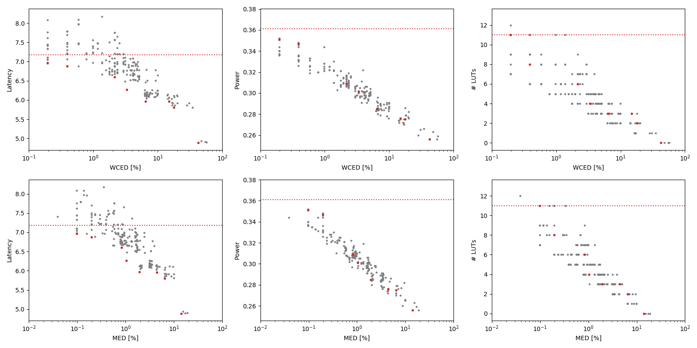

Selected circuits
===================
 - **Circuit**: 8-bit unsigned adders
 - **Selection criteria**: pareto optimal sub-set wrt. WCED [%] and Latency parameters

Parameters of selected circuits
----------------------------

| Circuit name | MAE% | WCE% | EP% | MRE% | MSE | PowerW | Delayns | LUTs | Download |
| --- |  --- | --- | --- | --- | --- | --- | --- | --- | --- |
| add8u_3LC | 0.00 | 0.00 | 0.00 | 0.00 | 0 | 0.36 | 7.2 | 11 |  [[Verilog](add8u_3LC.v)] [[VerilogPDK45](add8u_3LC_pdk45.v)] [[C](add8u_3LC.c)] |
| add8u_2LQ | 0.098 | 0.20 | 50.00 | 0.27 | 0.5 | 0.35 | 7.0 | 11 |  [[Verilog](add8u_2LQ.v)] [[VerilogPDK45](add8u_2LQ_pdk45.v)] [[C](add8u_2LQ.c)] |
| add8u_174 | 0.20 | 0.39 | 75.00 | 0.54 | 1.5 | 0.35 | 6.9 | 8.0 |  [[Verilog](add8u_174.v)] [[VerilogPDK45](add8u_174_pdk45.v)] [[C](add8u_174.c)] |
| add8u_01E | 0.82 | 2.15 | 93.75 | 2.28 | 24 | 0.31 | 6.6 | 6.0 |  [[Verilog](add8u_01E.v)] [[VerilogPDK45](add8u_01E_pdk45.v)] [[C](add8u_01E.c)] |
| add8u_04G | 1.04 | 3.32 | 94.24 | 2.81 | 42 | 0.3 | 6.3 | 4.0 |  [[Verilog](add8u_04G.v)] [[VerilogPDK45](add8u_04G_pdk45.v)] [[C](add8u_04G.c)] |
| add8u_01X | 1.93 | 6.45 | 97.02 | 5.96 | 148 | 0.29 | 6.0 | 3.0 |  [[Verilog](add8u_01X.v)] [[VerilogPDK45](add8u_01X_pdk45.v)] [[C](add8u_01X.c)] |
| add8u_0AX | 4.43 | 14.84 | 98.65 | 12.37 | 775 | 0.28 | 6.0 | 3.0 |  [[Verilog](add8u_0AX.v)] [[VerilogPDK45](add8u_0AX_pdk45.v)] [[C](add8u_0AX.c)] |
| add8u_06S | 6.48 | 17.77 | 99.22 | 16.90 | 1520 | 0.28 | 5.8 | 2.0 |  [[Verilog](add8u_06S.v)] [[VerilogPDK45](add8u_06S_pdk45.v)] [[C](add8u_06S.c)] |
| add8u_04A | 14.06 | 42.38 | 99.61 | 35.29 | 7477 | 0.26 | 4.9 | 0 |  [[Verilog](add8u_04A.v)] [[VerilogPDK45](add8u_04A_pdk45.v)] [[C](add8u_04A.c)] |
    
Parameters
--------------

References
--------------
PRABAKARAN B. S., MRAZEK V., VASICEK Z., SEKANINA L., SHAFIQUE M. ApproxFPGAs: Embracing ASIC-based Approximate Arithmetic Components for FPGA-Based Systems. DAC 2020.

             