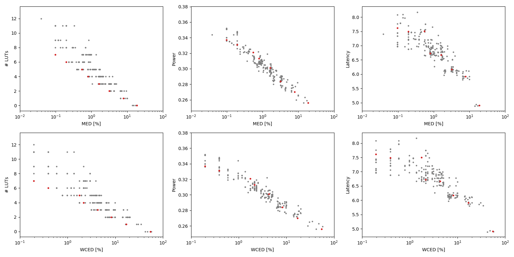

Selected circuits
===================
 - **Circuit**: 8-bit unsigned adders
 - **Selection criteria**: pareto optimal sub-set wrt. MED [%] and # LUTs parameters

Parameters of selected circuits
----------------------------

| Circuit name | MAE% | WCE% | EP% | MRE% | MSE | PowerW | Delayns | LUTs | Download |
| --- |  --- | --- | --- | --- | --- | --- | --- | --- | --- |
| add8u_00Z | 0.098 | 0.20 | 50.00 | 0.27 | 0.5 | 0.34 | 7.6 | 7.0 |  [[Verilog](add8u_00Z.v)] [[VerilogPDK45](add8u_00Z_pdk45.v)] [[C](add8u_00Z.c)] |
| add8u_00L | 0.20 | 0.39 | 75.00 | 0.54 | 1.5 | 0.33 | 7.5 | 6.0 |  [[Verilog](add8u_00L.v)] [[VerilogPDK45](add8u_00L_pdk45.v)] [[C](add8u_00L.c)] |
| add8u_001 | 0.55 | 1.76 | 89.26 | 1.59 | 12 | 0.32 | 7.5 | 5.0 |  [[Verilog](add8u_001.v)] [[VerilogPDK45](add8u_001_pdk45.v)] [[C](add8u_001.c)] |
| add8u_01M | 0.80 | 2.15 | 93.75 | 2.27 | 24 | 0.31 | 6.7 | 4.0 |  [[Verilog](add8u_01M.v)] [[VerilogPDK45](add8u_01M_pdk45.v)] [[C](add8u_01M.c)] |
| add8u_01U | 1.62 | 4.30 | 96.92 | 4.49 | 95 | 0.3 | 6.7 | 3.0 |  [[Verilog](add8u_01U.v)] [[VerilogPDK45](add8u_01U_pdk45.v)] [[C](add8u_01U.c)] |
| add8u_05J | 3.18 | 8.20 | 98.83 | 8.79 | 351 | 0.28 | 6.2 | 2.0 |  [[Verilog](add8u_05J.v)] [[VerilogPDK45](add8u_05J_pdk45.v)] [[C](add8u_05J.c)] |
| add8u_06R | 7.83 | 16.99 | 99.76 | 20.38 | 2008 | 0.27 | 5.9 | 1.0 |  [[Verilog](add8u_06R.v)] [[VerilogPDK45](add8u_06R_pdk45.v)] [[C](add8u_06R.c)] |
| add8u_01H | 18.87 | 54.69 | 99.71 | 45.94 | 13848 | 0.26 | 4.9 | 0 |  [[Verilog](add8u_01H.v)] [[VerilogPDK45](add8u_01H_pdk45.v)] [[C](add8u_01H.c)] |
    
Parameters
--------------

References
--------------
PRABAKARAN B. S., MRAZEK V., VASICEK Z., SEKANINA L., SHAFIQUE M. ApproxFPGAs: Embracing ASIC-based Approximate Arithmetic Components for FPGA-Based Systems. DAC 2020.

             