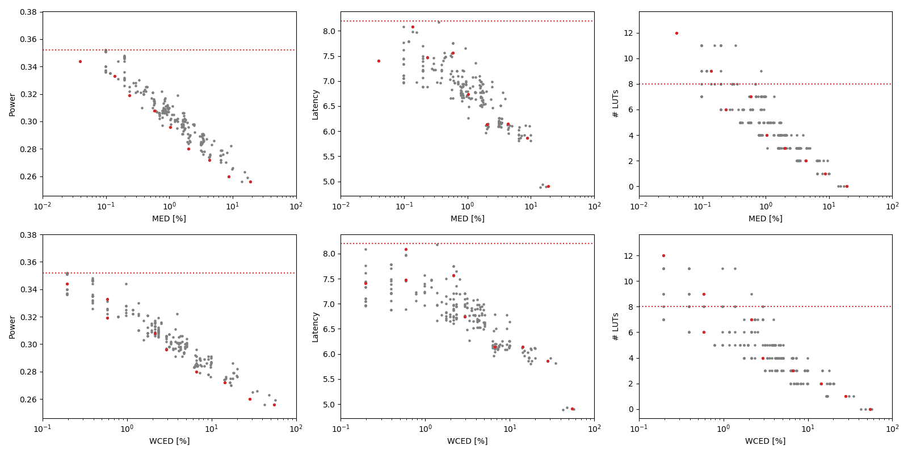

Selected circuits
===================
 - **Circuit**: 8-bit unsigned adders
 - **Selection criteria**: pareto optimal sub-set wrt. MED [%] and Power parameters

Parameters of selected circuits
----------------------------

| Circuit name | MAE% | WCE% | EP% | MRE% | MSE | PowerW | Delayns | LUTs | Download |
| --- |  --- | --- | --- | --- | --- | --- | --- | --- | --- |
| add8u_0FP | 0.00 | 0.00 | 0.00 | 0.00 | 0 | 0.35 | 8.2 | 8.0 |  [[Verilog](add8u_0FP.v)] [[VerilogPDK45](add8u_0FP_pdk45.v)] [[C](add8u_0FP.c)] |
| add8u_5K5 | 0.039 | 0.20 | 25.00 | 0.14 | 0.2 | 0.34 | 7.4 | 12 |  [[Verilog](add8u_5K5.v)] [[VerilogPDK45](add8u_5K5_pdk45.v)] [[C](add8u_5K5.c)] |
| add8u_5L3 | 0.14 | 0.59 | 43.75 | 0.39 | 1.5 | 0.33 | 8.1 | 9.0 |  [[Verilog](add8u_5L3.v)] [[VerilogPDK45](add8u_5L3_pdk45.v)] [[C](add8u_5L3.c)] |
| add8u_016 | 0.23 | 0.59 | 75.00 | 0.69 | 2.5 | 0.32 | 7.5 | 6.0 |  [[Verilog](add8u_016.v)] [[VerilogPDK45](add8u_016_pdk45.v)] [[C](add8u_016.c)] |
| add8u_5F7 | 0.59 | 2.15 | 84.77 | 1.60 | 18 | 0.31 | 7.6 | 7.0 |  [[Verilog](add8u_5F7.v)] [[VerilogPDK45](add8u_5F7_pdk45.v)] [[C](add8u_5F7.c)] |
| add8u_5P7 | 1.04 | 2.93 | 93.75 | 2.82 | 42 | 0.3 | 6.7 | 4.0 |  [[Verilog](add8u_5P7.v)] [[VerilogPDK45](add8u_5P7_pdk45.v)] [[C](add8u_5P7.c)] |
| add8u_044 | 2.01 | 6.64 | 97.07 | 6.10 | 160 | 0.28 | 6.1 | 3.0 |  [[Verilog](add8u_044.v)] [[VerilogPDK45](add8u_044_pdk45.v)] [[C](add8u_044.c)] |
| add8u_0BN | 4.34 | 14.26 | 98.61 | 14.04 | 744 | 0.27 | 6.1 | 2.0 |  [[Verilog](add8u_0BN.v)] [[VerilogPDK45](add8u_0BN_pdk45.v)] [[C](add8u_0BN.c)] |
| add8u_07X | 8.75 | 28.12 | 99.32 | 25.92 | 3019 | 0.26 | 5.9 | 1.0 |  [[Verilog](add8u_07X.v)] [[VerilogPDK45](add8u_07X_pdk45.v)] [[C](add8u_07X.c)] |
| add8u_01H | 18.87 | 54.69 | 99.71 | 45.94 | 13848 | 0.26 | 4.9 | 0 |  [[Verilog](add8u_01H.v)] [[VerilogPDK45](add8u_01H_pdk45.v)] [[C](add8u_01H.c)] |
    
Parameters
--------------

References
--------------
PRABAKARAN B. S., MRAZEK V., VASICEK Z., SEKANINA L., SHAFIQUE M. ApproxFPGAs: Embracing ASIC-based Approximate Arithmetic Components for FPGA-Based Systems. DAC 2020.

             