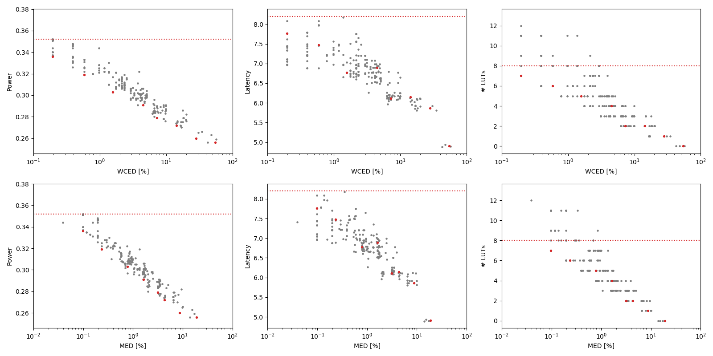

Selected circuits
===================
 - **Circuit**: 8-bit unsigned adders
 - **Selection criteria**: pareto optimal sub-set wrt. WCED [%] and Power parameters

Parameters of selected circuits
----------------------------

| Circuit name | MAE% | WCE% | EP% | MRE% | MSE | PowerW | Delayns | LUTs | Download |
| --- |  --- | --- | --- | --- | --- | --- | --- | --- | --- |
| add8u_0FP | 0.00 | 0.00 | 0.00 | 0.00 | 0 | 0.35 | 8.2 | 8.0 |  [[Verilog](add8u_0FP.v)] [[VerilogPDK45](add8u_0FP_pdk45.v)] [[C](add8u_0FP.c)] |
| add8u_0EE | 0.098 | 0.20 | 50.00 | 0.27 | 0.5 | 0.34 | 7.8 | 7.0 |  [[Verilog](add8u_0EE.v)] [[VerilogPDK45](add8u_0EE_pdk45.v)] [[C](add8u_0EE.c)] |
| add8u_016 | 0.23 | 0.59 | 75.00 | 0.69 | 2.5 | 0.32 | 7.5 | 6.0 |  [[Verilog](add8u_016.v)] [[VerilogPDK45](add8u_016_pdk45.v)] [[C](add8u_016.c)] |
| add8u_4F0 | 0.78 | 1.56 | 93.75 | 2.18 | 22 | 0.3 | 6.8 | 5.0 |  [[Verilog](add8u_4F0.v)] [[VerilogPDK45](add8u_4F0_pdk45.v)] [[C](add8u_4F0.c)] |
| add8u_2RD | 1.62 | 4.49 | 96.88 | 4.54 | 99 | 0.29 | 6.9 | 4.0 |  [[Verilog](add8u_2RD.v)] [[VerilogPDK45](add8u_2RD_pdk45.v)] [[C](add8u_2RD.c)] |
| add8u_0A5 | 3.14 | 7.23 | 98.44 | 8.58 | 350 | 0.28 | 6.1 | 2.0 |  [[Verilog](add8u_0A5.v)] [[VerilogPDK45](add8u_0A5_pdk45.v)] [[C](add8u_0A5.c)] |
| add8u_0BN | 4.34 | 14.26 | 98.61 | 14.04 | 744 | 0.27 | 6.1 | 2.0 |  [[Verilog](add8u_0BN.v)] [[VerilogPDK45](add8u_0BN_pdk45.v)] [[C](add8u_0BN.c)] |
| add8u_07X | 8.75 | 28.12 | 99.32 | 25.92 | 3019 | 0.26 | 5.9 | 1.0 |  [[Verilog](add8u_07X.v)] [[VerilogPDK45](add8u_07X_pdk45.v)] [[C](add8u_07X.c)] |
| add8u_01H | 18.87 | 54.69 | 99.71 | 45.94 | 13848 | 0.26 | 4.9 | 0 |  [[Verilog](add8u_01H.v)] [[VerilogPDK45](add8u_01H_pdk45.v)] [[C](add8u_01H.c)] |
    
Parameters
--------------

References
--------------
PRABAKARAN B. S., MRAZEK V., VASICEK Z., SEKANINA L., SHAFIQUE M. ApproxFPGAs: Embracing ASIC-based Approximate Arithmetic Components for FPGA-Based Systems. DAC 2020.

             