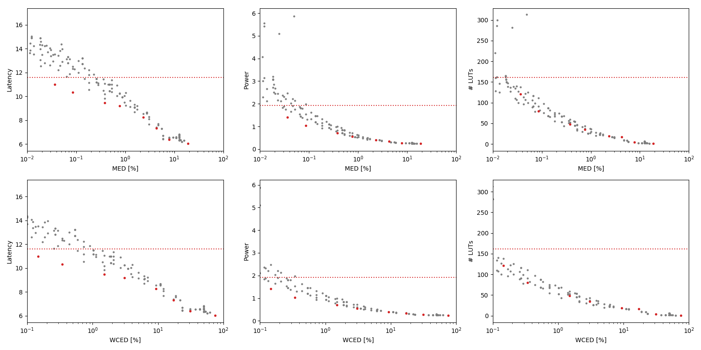

Selected circuits
===================
 - **Circuit**: 12-bit unsigned multipliers
 - **Selection criteria**: pareto optimal sub-set wrt. MED [%] and Latency parameters

Parameters of selected circuits
----------------------------

| Circuit name | MAE% | WCE% | EP% | MRE% | MSE | PowerW | Delayns | LUTs | Download |
| --- |  --- | --- | --- | --- | --- | --- | --- | --- | --- |
| mul12u_34M | 0.00 | 0.00 | 0.00 | 0.00 | 0 | 1.9 | 12 | 161 |  [[Verilog](mul12u_34M.v)] [[VerilogPDK45](mul12u_34M_pdk45.v)] [[C](mul12u_34M.c)] |
| mul12u_338 | 0.037 | 0.15 | 93.71 | 0.65 | 57970.012e3 | 1.4 | 11 | 121 |  [[Verilog](mul12u_338.v)] [[VerilogPDK45](mul12u_338_pdk45.v)] [[C](mul12u_338.c)] |
| mul12u_343 | 0.085 | 0.34 | 98.39 | 1.38 | 29802.164e4 | 1.0 | 10 | 80 |  [[Verilog](mul12u_343.v)] [[VerilogPDK45](mul12u_343_pdk45.v)] [[C](mul12u_343.c)] |
| mul12u_368 | 0.38 | 1.51 | 99.86 | 5.01 | 56232.128e5 | 0.71 | 9.5 | 48 |  [[Verilog](mul12u_368.v)] [[VerilogPDK45](mul12u_368_pdk45.v)] [[C](mul12u_368.c)] |
| mul12u_33H | 0.76 | 3.05 | 99.93 | 9.02 | 22973.221e6 | 0.55 | 9.2 | 35 |  [[Verilog](mul12u_33H.v)] [[VerilogPDK45](mul12u_33H_pdk45.v)] [[C](mul12u_33H.c)] |
| mul12u_2TL | 2.33 | 9.33 | 99.95 | 22.85 | 21622.414e7 | 0.39 | 8.3 | 19 |  [[Verilog](mul12u_2TL.v)] [[VerilogPDK45](mul12u_2TL_pdk45.v)] [[C](mul12u_2TL.c)] |
| mul12u_2PD | 4.28 | 17.14 | 99.95 | 34.95 | 76007.139e7 | 0.34 | 7.3 | 17 |  [[Verilog](mul12u_2PD.v)] [[VerilogPDK45](mul12u_2PD_pdk45.v)] [[C](mul12u_2PD.c)] |
| mul12u_2E5 | 7.80 | 31.20 | 99.95 | 53.70 | 24064.241e8 | 0.27 | 6.4 | 4.0 |  [[Verilog](mul12u_2E5.v)] [[VerilogPDK45](mul12u_2E5_pdk45.v)] [[C](mul12u_2E5.c)] |
| mul12u_35V | 18.74 | 74.95 | 99.95 | 87.98 | 15865.376e9 | 0.25 | 6.0 | 1.0 |  [[Verilog](mul12u_35V.v)] [[VerilogPDK45](mul12u_35V_pdk45.v)] [[C](mul12u_35V.c)] |
    
Parameters
--------------

References
--------------
PRABAKARAN B. S., MRAZEK V., VASICEK Z., SEKANINA L., SHAFIQUE M. ApproxFPGAs: Embracing ASIC-based Approximate Arithmetic Components for FPGA-Based Systems. DAC 2020.

             