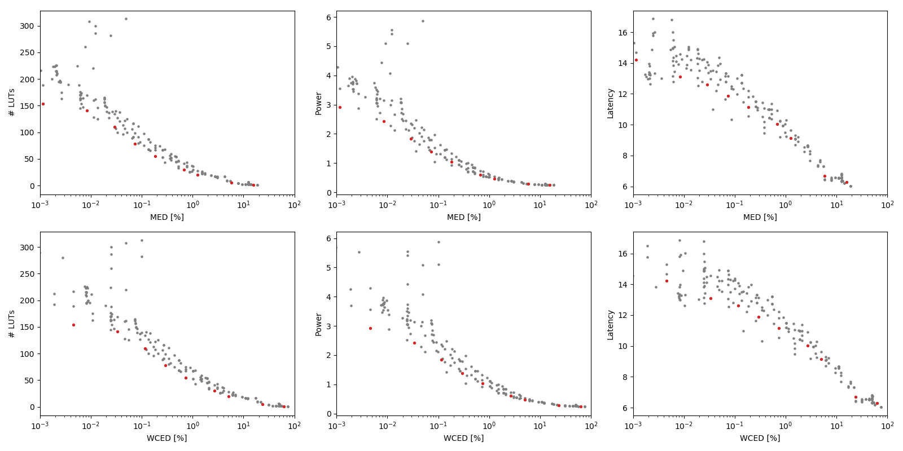

Selected circuits
===================
 - **Circuit**: 12-bit unsigned multipliers
 - **Selection criteria**: pareto optimal sub-set wrt. MED [%] and # LUTs parameters

Parameters of selected circuits
----------------------------

| Circuit name | MAE% | WCE% | EP% | MRE% | MSE | PowerW | Delayns | LUTs | Download |
| --- |  --- | --- | --- | --- | --- | --- | --- | --- | --- |
| mul12u_2VU | 0.0011 | 0.0046 | 96.48 | 0.057 | 50190 | 2.9 | 14 | 154 |  [[Verilog](mul12u_2VU.v)] [[VerilogPDK45](mul12u_2VU_pdk45.v)] [[C](mul12u_2VU.c)] |
| mul12u_2XL | 0.0084 | 0.034 | 98.23 | 0.22 | 37859.022e2 | 2.4 | 13 | 141 |  [[Verilog](mul12u_2XL.v)] [[VerilogPDK45](mul12u_2XL_pdk45.v)] [[C](mul12u_2XL.c)] |
| mul12u_2U9 | 0.029 | 0.12 | 99.49 | 0.68 | 34858.382e3 | 1.8 | 13 | 110 |  [[Verilog](mul12u_2U9.v)] [[VerilogPDK45](mul12u_2U9_pdk45.v)] [[C](mul12u_2U9.c)] |
| mul12u_2U7 | 0.073 | 0.29 | 99.84 | 1.67 | 18304.091e4 | 1.4 | 12 | 78 |  [[Verilog](mul12u_2U7.v)] [[VerilogPDK45](mul12u_2U7_pdk45.v)] [[C](mul12u_2U7.c)] |
| mul12u_2XA | 0.18 | 0.73 | 99.90 | 3.29 | 12148.233e5 | 1.0 | 11 | 55 |  [[Verilog](mul12u_2XA.v)] [[VerilogPDK45](mul12u_2XA_pdk45.v)] [[C](mul12u_2XA.c)] |
| mul12u_2V7 | 0.67 | 2.69 | 99.94 | 9.07 | 16904.318e6 | 0.6 | 10 | 30 |  [[Verilog](mul12u_2V7.v)] [[VerilogPDK45](mul12u_2V7_pdk45.v)] [[C](mul12u_2V7.c)] |
| mul12u_2QA | 1.26 | 5.03 | 99.95 | 14.56 | 60863.622e6 | 0.47 | 9.1 | 20 |  [[Verilog](mul12u_2QA.v)] [[VerilogPDK45](mul12u_2QA_pdk45.v)] [[C](mul12u_2QA.c)] |
| mul12u_34H | 5.85 | 23.39 | 99.95 | 43.11 | 13857.988e8 | 0.28 | 6.7 | 5.0 |  [[Verilog](mul12u_34H.v)] [[VerilogPDK45](mul12u_34H_pdk45.v)] [[C](mul12u_34H.c)] |
| mul12u_2NR | 15.61 | 62.45 | 99.95 | 79.47 | 10920.526e9 | 0.25 | 6.3 | 1.0 |  [[Verilog](mul12u_2NR.v)] [[VerilogPDK45](mul12u_2NR_pdk45.v)] [[C](mul12u_2NR.c)] |
    
Parameters
--------------

References
--------------
PRABAKARAN B. S., MRAZEK V., VASICEK Z., SEKANINA L., SHAFIQUE M. ApproxFPGAs: Embracing ASIC-based Approximate Arithmetic Components for FPGA-Based Systems. DAC 2020.

             