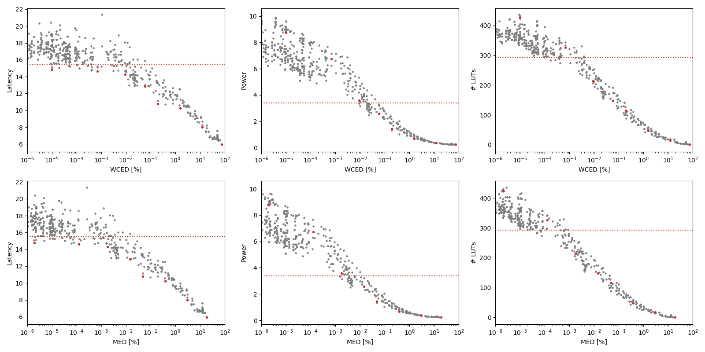

Selected circuits
===================
 - **Circuit**: 16-bit unsigned multipliers
 - **Selection criteria**: pareto optimal sub-set wrt. WCED [%] and Latency parameters

Parameters of selected circuits
----------------------------

| Circuit name | MAE% | WCE% | EP% | MRE% | MSE | PowerW | Delayns | LUTs | Download |
| --- |  --- | --- | --- | --- | --- | --- | --- | --- | --- |
| mul16u_HFD | 0.00 | 0.00 | 0.00 | 0.00 | 0 | 3.4 | 15 | 292 |  [[Verilog](mul16u_HFD.v)] [[VerilogPDK45](mul16u_HFD_pdk45.v)] [[C](mul16u_HFD.c)] |
| mul16u_024 | 0.000002 | 0.0000097 | 99.14 | 0.00028 | 11045 | 8.8 | 15 | 426 |  [[Verilog](mul16u_024.v)] [[VerilogPDK45](mul16u_024_pdk45.v)] [[C](mul16u_024.c)] |
| mul16u_0CM | 0.00012 | 0.00068 | 99.97 | 0.012 | 43249.098e3 | 6.7 | 15 | 326 |  [[Verilog](mul16u_0CM.v)] [[VerilogPDK45](mul16u_0CM_pdk45.v)] [[C](mul16u_0CM.c)] |
| mul16u_877 | 0.0018 | 0.0092 | 99.98 | 0.10 | 87594.761e5 | 3.6 | 14 | 214 |  [[Verilog](mul16u_877.v)] [[VerilogPDK45](mul16u_877_pdk45.v)] [[C](mul16u_877.c)] |
| mul16u_HBN | 0.014 | 0.058 | 99.99 | 0.41 | 46704.777e7 | 2.6 | 13 | 148 |  [[Verilog](mul16u_HBN.v)] [[VerilogPDK45](mul16u_HBN_pdk45.v)] [[C](mul16u_HBN.c)] |
| mul16u_HHB | 0.048 | 0.19 | 99.97 | 0.84 | 59448.176e8 | 1.4 | 11 | 115 |  [[Verilog](mul16u_HHB.v)] [[VerilogPDK45](mul16u_HHB_pdk45.v)] [[C](mul16u_HHB.c)] |
| mul16u_HFR | 0.39 | 1.55 | 100.00 | 5.15 | 38746.053e10 | 0.69 | 10 | 47 |  [[Verilog](mul16u_HFR.v)] [[VerilogPDK45](mul16u_HFR_pdk45.v)] [[C](mul16u_HFR.c)] |
| mul16u_HEN | 3.03 | 12.11 | 100.00 | 26.79 | 23887.935e12 | 0.36 | 8.0 | 15 |  [[Verilog](mul16u_HEN.v)] [[VerilogPDK45](mul16u_HEN_pdk45.v)] [[C](mul16u_HEN.c)] |
| mul16u_HEZ | 18.75 | 75.00 | 100.00 | 87.99 | 10407.645e14 | 0.25 | 6.0 | 1.0 |  [[Verilog](mul16u_HEZ.v)] [[VerilogPDK45](mul16u_HEZ_pdk45.v)] [[C](mul16u_HEZ.c)] |
    
Parameters
--------------

References
--------------
PRABAKARAN B. S., MRAZEK V., VASICEK Z., SEKANINA L., SHAFIQUE M. ApproxFPGAs: Embracing ASIC-based Approximate Arithmetic Components for FPGA-Based Systems. DAC 2020.

             