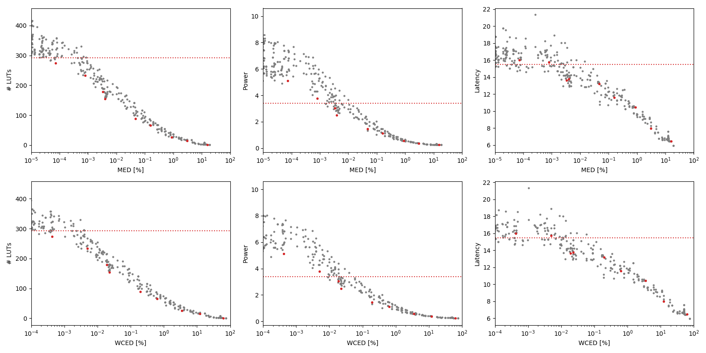

Selected circuits
===================
 - **Circuit**: 16-bit unsigned multipliers
 - **Selection criteria**: pareto optimal sub-set wrt. MED [%] and # LUTs parameters

Parameters of selected circuits
----------------------------

| Circuit name | MAE% | WCE% | EP% | MRE% | MSE | PowerW | Delayns | LUTs | Download |
| --- |  --- | --- | --- | --- | --- | --- | --- | --- | --- |
| mul16u_HFD | 0.00 | 0.00 | 0.00 | 0.00 | 0 | 3.4 | 15 | 292 |  [[Verilog](mul16u_HFD.v)] [[VerilogPDK45](mul16u_HFD_pdk45.v)] [[C](mul16u_HFD.c)] |
| mul16u_3UT | 0.000073 | 0.00042 | 99.85 | 0.0064 | 15325.312e3 | 5.1 | 16 | 274 |  [[Verilog](mul16u_3UT.v)] [[VerilogPDK45](mul16u_3UT_pdk45.v)] [[C](mul16u_3UT.c)] |
| mul16u_4Y6 | 0.0008 | 0.005 | 99.99 | 0.049 | 18219.121e5 | 3.8 | 16 | 233 |  [[Verilog](mul16u_4Y6.v)] [[VerilogPDK45](mul16u_4Y6_pdk45.v)] [[C](mul16u_4Y6.c)] |
| mul16u_82M | 0.0034 | 0.019 | 99.99 | 0.18 | 31960.408e6 | 3.0 | 14 | 179 |  [[Verilog](mul16u_82M.v)] [[VerilogPDK45](mul16u_82M_pdk45.v)] [[C](mul16u_82M.c)] |
| mul16u_89C | 0.004 | 0.023 | 99.99 | 0.20 | 44931.821e6 | 2.5 | 14 | 154 |  [[Verilog](mul16u_89C.v)] [[VerilogPDK45](mul16u_89C_pdk45.v)] [[C](mul16u_89C.c)] |
| mul16u_6NY | 0.048 | 0.20 | 100.00 | 1.34 | 61508.569e8 | 1.5 | 13 | 89 |  [[Verilog](mul16u_6NY.v)] [[VerilogPDK45](mul16u_6NY_pdk45.v)] [[C](mul16u_6NY.c)] |
| mul16u_H6P | 0.16 | 0.63 | 100.00 | 3.06 | 55158.891e9 | 1.1 | 12 | 66 |  [[Verilog](mul16u_H6P.v)] [[VerilogPDK45](mul16u_H6P_pdk45.v)] [[C](mul16u_H6P.c)] |
| mul16u_G8D | 0.88 | 3.51 | 100.00 | 11.81 | 17642.903e11 | 0.56 | 10 | 26 |  [[Verilog](mul16u_G8D.v)] [[VerilogPDK45](mul16u_G8D_pdk45.v)] [[C](mul16u_G8D.c)] |
| mul16u_HEN | 3.03 | 12.11 | 100.00 | 26.79 | 23887.935e12 | 0.36 | 8.0 | 15 |  [[Verilog](mul16u_HEN.v)] [[VerilogPDK45](mul16u_HEN_pdk45.v)] [[C](mul16u_HEN.c)] |
| mul16u_G9P | 15.62 | 62.50 | 100.00 | 79.49 | 71651.74e13 | 0.25 | 6.5 | 1.0 |  [[Verilog](mul16u_G9P.v)] [[VerilogPDK45](mul16u_G9P_pdk45.v)] [[C](mul16u_G9P.c)] |
    
Parameters
--------------

References
--------------
PRABAKARAN B. S., MRAZEK V., VASICEK Z., SEKANINA L., SHAFIQUE M. ApproxFPGAs: Embracing ASIC-based Approximate Arithmetic Components for FPGA-Based Systems. DAC 2020.

             