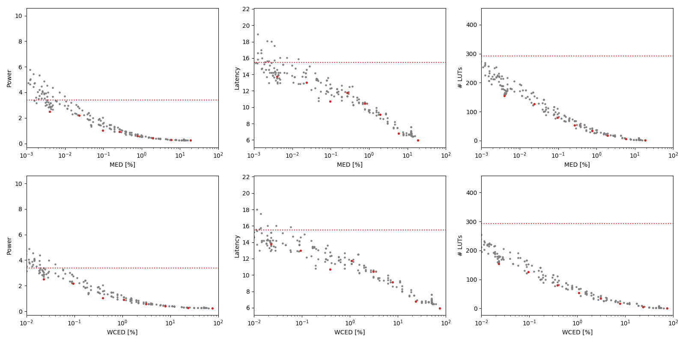

Selected circuits
===================
 - **Circuit**: 16-bit unsigned multipliers
 - **Selection criteria**: pareto optimal sub-set wrt. MED [%] and Power parameters

Parameters of selected circuits
----------------------------

| Circuit name | MAE% | WCE% | EP% | MRE% | MSE | PowerW | Delayns | LUTs | Download |
| --- |  --- | --- | --- | --- | --- | --- | --- | --- | --- |
| mul16u_HFD | 0.00 | 0.00 | 0.00 | 0.00 | 0 | 3.4 | 15 | 292 |  [[Verilog](mul16u_HFD.v)] [[VerilogPDK45](mul16u_HFD_pdk45.v)] [[C](mul16u_HFD.c)] |
| mul16u_89C | 0.004 | 0.023 | 99.99 | 0.20 | 44931.821e6 | 2.5 | 14 | 154 |  [[Verilog](mul16u_89C.v)] [[VerilogPDK45](mul16u_89C_pdk45.v)] [[C](mul16u_89C.c)] |
| mul16u_HBT | 0.024 | 0.095 | 99.99 | 0.65 | 12001.455e8 | 2.2 | 13 | 126 |  [[Verilog](mul16u_HBT.v)] [[VerilogPDK45](mul16u_HBT_pdk45.v)] [[C](mul16u_HBT.c)] |
| mul16u_HE2 | 0.097 | 0.39 | 99.99 | 1.56 | 24079.74e9 | 1.0 | 11 | 80 |  [[Verilog](mul16u_HE2.v)] [[VerilogPDK45](mul16u_HE2_pdk45.v)] [[C](mul16u_HE2.c)] |
| mul16u_GC6 | 0.27 | 1.07 | 100.00 | 4.75 | 15872.778e10 | 0.92 | 12 | 53 |  [[Verilog](mul16u_GC6.v)] [[VerilogPDK45](mul16u_GC6_pdk45.v)] [[C](mul16u_GC6.c)] |
| mul16u_HDR | 0.77 | 3.10 | 100.00 | 9.15 | 15436.2e11 | 0.57 | 10 | 34 |  [[Verilog](mul16u_HDR.v)] [[VerilogPDK45](mul16u_HDR_pdk45.v)] [[C](mul16u_HDR.c)] |
| mul16u_GRC | 1.95 | 7.81 | 100.00 | 19.30 | 10697.458e12 | 0.41 | 9.1 | 17 |  [[Verilog](mul16u_GRC.v)] [[VerilogPDK45](mul16u_GRC_pdk45.v)] [[C](mul16u_GRC.c)] |
| mul16u_HDT | 5.86 | 23.43 | 100.00 | 43.16 | 91115.598e12 | 0.28 | 6.8 | 5.0 |  [[Verilog](mul16u_HDT.v)] [[VerilogPDK45](mul16u_HDT_pdk45.v)] [[C](mul16u_HDT.c)] |
| mul16u_HEZ | 18.75 | 75.00 | 100.00 | 87.99 | 10407.645e14 | 0.25 | 6.0 | 1.0 |  [[Verilog](mul16u_HEZ.v)] [[VerilogPDK45](mul16u_HEZ_pdk45.v)] [[C](mul16u_HEZ.c)] |
    
Parameters
--------------

References
--------------
PRABAKARAN B. S., MRAZEK V., VASICEK Z., SEKANINA L., SHAFIQUE M. ApproxFPGAs: Embracing ASIC-based Approximate Arithmetic Components for FPGA-Based Systems. DAC 2020.

             