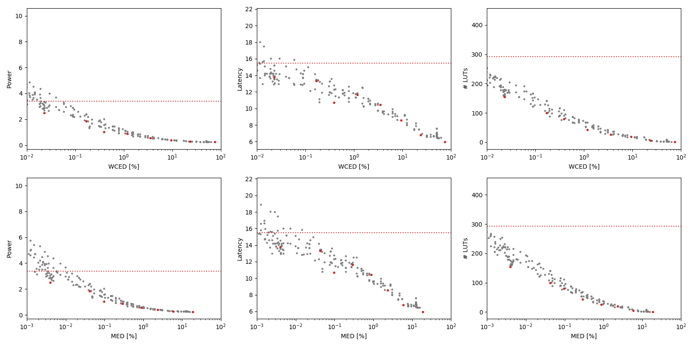

Selected circuits
===================
 - **Circuit**: 16-bit unsigned multipliers
 - **Selection criteria**: pareto optimal sub-set wrt. WCED [%] and Power parameters

Parameters of selected circuits
----------------------------

| Circuit name | MAE% | WCE% | EP% | MRE% | MSE | PowerW | Delayns | LUTs | Download |
| --- |  --- | --- | --- | --- | --- | --- | --- | --- | --- |
| mul16u_HFD | 0.00 | 0.00 | 0.00 | 0.00 | 0 | 3.4 | 15 | 292 |  [[Verilog](mul16u_HFD.v)] [[VerilogPDK45](mul16u_HFD_pdk45.v)] [[C](mul16u_HFD.c)] |
| mul16u_89C | 0.004 | 0.023 | 99.99 | 0.20 | 44931.821e6 | 2.5 | 14 | 154 |  [[Verilog](mul16u_89C.v)] [[VerilogPDK45](mul16u_89C_pdk45.v)] [[C](mul16u_89C.c)] |
| mul16u_G3R | 0.042 | 0.17 | 100.00 | 1.07 | 37739.059e8 | 1.9 | 13 | 100 |  [[Verilog](mul16u_G3R.v)] [[VerilogPDK45](mul16u_G3R_pdk45.v)] [[C](mul16u_G3R.c)] |
| mul16u_HE2 | 0.097 | 0.39 | 99.99 | 1.56 | 24079.74e9 | 1.0 | 11 | 80 |  [[Verilog](mul16u_HE2.v)] [[VerilogPDK45](mul16u_HE2_pdk45.v)] [[C](mul16u_HE2.c)] |
| mul16u_GAC | 0.29 | 1.17 | 100.00 | 4.98 | 19162.717e10 | 0.88 | 12 | 43 |  [[Verilog](mul16u_GAC.v)] [[VerilogPDK45](mul16u_GAC_pdk45.v)] [[C](mul16u_GAC.c)] |
| mul16u_G8D | 0.88 | 3.51 | 100.00 | 11.81 | 17642.903e11 | 0.56 | 10 | 26 |  [[Verilog](mul16u_G8D.v)] [[VerilogPDK45](mul16u_G8D_pdk45.v)] [[C](mul16u_G8D.c)] |
| mul16u_GAM | 2.34 | 9.37 | 100.00 | 22.94 | 14285.02e12 | 0.39 | 8.6 | 19 |  [[Verilog](mul16u_GAM.v)] [[VerilogPDK45](mul16u_GAM_pdk45.v)] [[C](mul16u_GAM.c)] |
| mul16u_HDT | 5.86 | 23.43 | 100.00 | 43.16 | 91115.598e12 | 0.28 | 6.8 | 5.0 |  [[Verilog](mul16u_HDT.v)] [[VerilogPDK45](mul16u_HDT_pdk45.v)] [[C](mul16u_HDT.c)] |
| mul16u_HEZ | 18.75 | 75.00 | 100.00 | 87.99 | 10407.645e14 | 0.25 | 6.0 | 1.0 |  [[Verilog](mul16u_HEZ.v)] [[VerilogPDK45](mul16u_HEZ_pdk45.v)] [[C](mul16u_HEZ.c)] |
    
Parameters
--------------

References
--------------
PRABAKARAN B. S., MRAZEK V., VASICEK Z., SEKANINA L., SHAFIQUE M. ApproxFPGAs: Embracing ASIC-based Approximate Arithmetic Components for FPGA-Based Systems. DAC 2020.

             