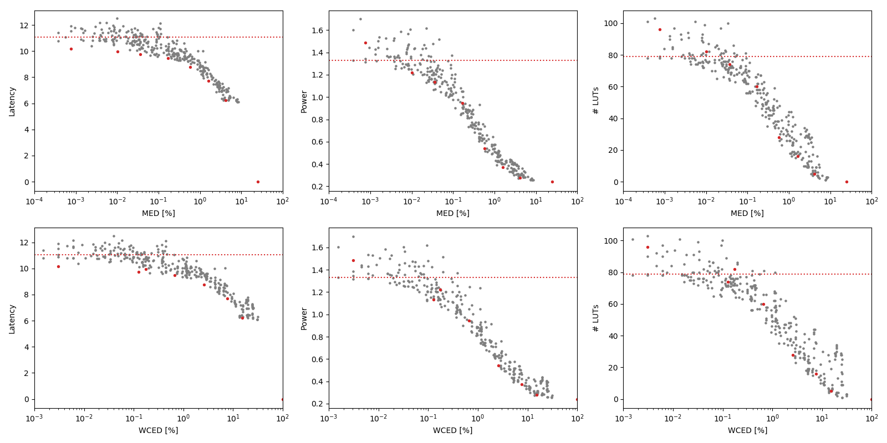

Selected circuits
===================
 - **Circuit**: 8-bit unsigned multipliers
 - **Selection criteria**: pareto optimal sub-set wrt. MED [%] and Latency parameters

Parameters of selected circuits
----------------------------

| Circuit name | MAE% | WCE% | EP% | MRE% | MSE | PowerW | Delayns | LUTs | Download |
| --- |  --- | --- | --- | --- | --- | --- | --- | --- | --- |
| mul8u_VXP | 0.00 | 0.00 | 0.00 | 0.00 | 0 | 1.3 | 11 | 79 |  [[Verilog](mul8u_VXP.v)] [[VerilogPDK45](mul8u_VXP_pdk45.v)] [[C](mul8u_VXP.c)] |
| mul8u_DBR | 0.00076 | 0.0031 | 25.00 | 0.03 | 1.0 | 1.5 | 10 | 96 |  [[Verilog](mul8u_DBR.v)] [[VerilogPDK45](mul8u_DBR_pdk45.v)] [[C](mul8u_DBR.c)] |
| mul8u_HFM | 0.01 | 0.17 | 19.82 | 0.16 | 324 | 1.2 | 10.0 | 82 |  [[Verilog](mul8u_HFM.v)] [[VerilogPDK45](mul8u_HFM_pdk45.v)] [[C](mul8u_HFM.c)] |
| mul8u_7G9 | 0.036 | 0.13 | 94.20 | 1.19 | 885 | 1.1 | 9.7 | 74 |  [[Verilog](mul8u_7G9.v)] [[VerilogPDK45](mul8u_7G9_pdk45.v)] [[C](mul8u_7G9.c)] |
| mul8u_19PQ | 0.17 | 0.66 | 98.38 | 3.99 | 18862 | 0.95 | 9.5 | 60 |  [[Verilog](mul8u_19PQ.v)] [[VerilogPDK45](mul8u_19PQ_pdk45.v)] [[C](mul8u_19PQ.c)] |
| mul8u_Y99 | 0.58 | 2.59 | 99.08 | 11.06 | 222637 | 0.54 | 8.8 | 28 |  [[Verilog](mul8u_Y99.v)] [[VerilogPDK45](mul8u_Y99_pdk45.v)] [[C](mul8u_Y99.c)] |
| mul8u_14HJ | 1.61 | 7.57 | 99.19 | 22.68 | 17428.185e2 | 0.37 | 7.7 | 16 |  [[Verilog](mul8u_14HJ.v)] [[VerilogPDK45](mul8u_14HJ_pdk45.v)] [[C](mul8u_14HJ.c)] |
| mul8u_L42 | 4.16 | 15.19 | 99.20 | 41.93 | 11489.87e3 | 0.28 | 6.2 | 5.0 |  [[Verilog](mul8u_L42.v)] [[VerilogPDK45](mul8u_L42_pdk45.v)] [[C](mul8u_L42.c)] |
| mul8u_199Z | 24.81 | 99.22 | 99.22 | 100.00 | 47164.981e4 | 0.24 | 0 | 0 |  [[Verilog](mul8u_199Z.v)] [[VerilogPDK45](mul8u_199Z_pdk45.v)] [[C](mul8u_199Z.c)] |
    
Parameters
--------------

References
--------------
PRABAKARAN B. S., MRAZEK V., VASICEK Z., SEKANINA L., SHAFIQUE M. ApproxFPGAs: Embracing ASIC-based Approximate Arithmetic Components for FPGA-Based Systems. DAC 2020.

             