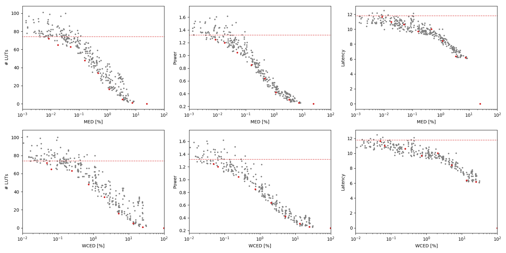

Selected circuits
===================
 - **Circuit**: 8-bit unsigned multipliers
 - **Selection criteria**: pareto optimal sub-set wrt. MED [%] and # LUTs parameters

Parameters of selected circuits
----------------------------

| Circuit name | MAE% | WCE% | EP% | MRE% | MSE | PowerW | Delayns | LUTs | Download |
| --- |  --- | --- | --- | --- | --- | --- | --- | --- | --- |
| mul8u_1JD3 | 0.00 | 0.00 | 0.00 | 0.00 | 0 | 1.3 | 12 | 74 |  [[Verilog](mul8u_1JD3.v)] [[VerilogPDK45](mul8u_1JD3_pdk45.v)] [[C](mul8u_1JD3.c)] |
| mul8u_589 | 0.0085 | 0.049 | 64.97 | 0.25 | 65 | 1.2 | 12 | 72 |  [[Verilog](mul8u_589.v)] [[VerilogPDK45](mul8u_589_pdk45.v)] [[C](mul8u_589.c)] |
| mul8u_5E8 | 0.018 | 0.066 | 84.96 | 0.62 | 233 | 1.2 | 11 | 65 |  [[Verilog](mul8u_5E8.v)] [[VerilogPDK45](mul8u_5E8_pdk45.v)] [[C](mul8u_5E8.c)] |
| mul8u_6LH | 0.051 | 0.25 | 84.76 | 1.28 | 2005 | 1.0 | 11 | 63 |  [[Verilog](mul8u_6LH.v)] [[VerilogPDK45](mul8u_6LH_pdk45.v)] [[C](mul8u_6LH.c)] |
| mul8u_GT4 | 0.16 | 0.73 | 96.25 | 3.68 | 17466 | 0.85 | 9.7 | 48 |  [[Verilog](mul8u_GT4.v)] [[VerilogPDK45](mul8u_GT4_pdk45.v)] [[C](mul8u_GT4.c)] |
| mul8u_176X | 0.47 | 2.06 | 98.93 | 9.37 | 145132 | 0.64 | 10 | 34 |  [[Verilog](mul8u_176X.v)] [[VerilogPDK45](mul8u_176X_pdk45.v)] [[C](mul8u_176X.c)] |
| mul8u_7T1 | 1.17 | 5.18 | 99.17 | 18.02 | 903134 | 0.42 | 8.4 | 16 |  [[Verilog](mul8u_7T1.v)] [[VerilogPDK45](mul8u_7T1_pdk45.v)] [[C](mul8u_7T1.c)] |
| mul8u_19SM | 3.39 | 13.56 | 99.21 | 36.51 | 79737.894e2 | 0.31 | 6.4 | 5.0 |  [[Verilog](mul8u_19SM.v)] [[VerilogPDK45](mul8u_19SM_pdk45.v)] [[C](mul8u_19SM.c)] |
| mul8u_17A6 | 7.51 | 25.01 | 99.22 | 59.60 | 38114.505e3 | 0.26 | 6.2 | 1.0 |  [[Verilog](mul8u_17A6.v)] [[VerilogPDK45](mul8u_17A6_pdk45.v)] [[C](mul8u_17A6.c)] |
| mul8u_199Z | 24.81 | 99.22 | 99.22 | 100.00 | 47164.981e4 | 0.24 | 0 | 0 |  [[Verilog](mul8u_199Z.v)] [[VerilogPDK45](mul8u_199Z_pdk45.v)] [[C](mul8u_199Z.c)] |
    
Parameters
--------------

References
--------------
PRABAKARAN B. S., MRAZEK V., VASICEK Z., SEKANINA L., SHAFIQUE M. ApproxFPGAs: Embracing ASIC-based Approximate Arithmetic Components for FPGA-Based Systems. DAC 2020.

             