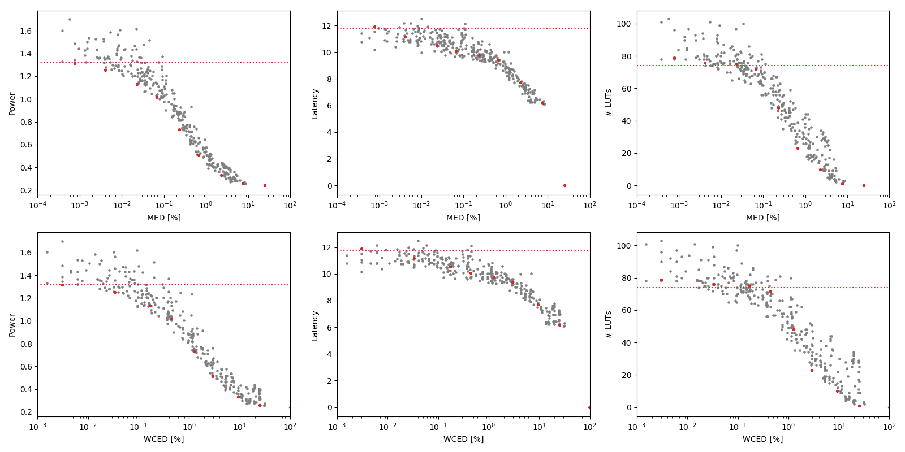

Selected circuits
===================
 - **Circuit**: 8-bit unsigned multipliers
 - **Selection criteria**: pareto optimal sub-set wrt. MED [%] and Power parameters

Parameters of selected circuits
----------------------------

| Circuit name | MAE% | WCE% | EP% | MRE% | MSE | PowerW | Delayns | LUTs | Download |
| --- |  --- | --- | --- | --- | --- | --- | --- | --- | --- |
| mul8u_1JD3 | 0.00 | 0.00 | 0.00 | 0.00 | 0 | 1.3 | 12 | 74 |  [[Verilog](mul8u_1JD3.v)] [[VerilogPDK45](mul8u_1JD3_pdk45.v)] [[C](mul8u_1JD3.c)] |
| mul8u_50M | 0.00076 | 0.0031 | 25.00 | 0.03 | 1.0 | 1.3 | 12 | 79 |  [[Verilog](mul8u_50M.v)] [[VerilogPDK45](mul8u_50M_pdk45.v)] [[C](mul8u_50M.c)] |
| mul8u_ABX | 0.0041 | 0.034 | 28.12 | 0.085 | 33 | 1.3 | 11 | 76 |  [[Verilog](mul8u_ABX.v)] [[VerilogPDK45](mul8u_ABX_pdk45.v)] [[C](mul8u_ABX.c)] |
| mul8u_158B | 0.023 | 0.17 | 50.85 | 0.37 | 645 | 1.1 | 11 | 75 |  [[Verilog](mul8u_158B.v)] [[VerilogPDK45](mul8u_158B_pdk45.v)] [[C](mul8u_158B.c)] |
| mul8u_10K5 | 0.067 | 0.44 | 69.94 | 0.91 | 4092 | 1.0 | 10 | 72 |  [[Verilog](mul8u_10K5.v)] [[VerilogPDK45](mul8u_10K5_pdk45.v)] [[C](mul8u_10K5.c)] |
| mul8u_FE8 | 0.23 | 1.25 | 94.98 | 4.52 | 37477 | 0.73 | 9.7 | 48 |  [[Verilog](mul8u_FE8.v)] [[VerilogPDK45](mul8u_FE8_pdk45.v)] [[C](mul8u_FE8.c)] |
| mul8u_18G6 | 0.66 | 2.93 | 99.03 | 12.00 | 297163 | 0.51 | 9.4 | 23 |  [[Verilog](mul8u_18G6.v)] [[VerilogPDK45](mul8u_18G6_pdk45.v)] [[C](mul8u_18G6.c)] |
| mul8u_17BE | 2.27 | 9.32 | 99.20 | 28.93 | 35240.883e2 | 0.33 | 7.7 | 10 |  [[Verilog](mul8u_17BE.v)] [[VerilogPDK45](mul8u_17BE_pdk45.v)] [[C](mul8u_17BE.c)] |
| mul8u_17A6 | 7.51 | 25.01 | 99.22 | 59.60 | 38114.505e3 | 0.26 | 6.2 | 1.0 |  [[Verilog](mul8u_17A6.v)] [[VerilogPDK45](mul8u_17A6_pdk45.v)] [[C](mul8u_17A6.c)] |
| mul8u_199Z | 24.81 | 99.22 | 99.22 | 100.00 | 47164.981e4 | 0.24 | 0 | 0 |  [[Verilog](mul8u_199Z.v)] [[VerilogPDK45](mul8u_199Z_pdk45.v)] [[C](mul8u_199Z.c)] |
    
Parameters
--------------

References
--------------
PRABAKARAN B. S., MRAZEK V., VASICEK Z., SEKANINA L., SHAFIQUE M. ApproxFPGAs: Embracing ASIC-based Approximate Arithmetic Components for FPGA-Based Systems. DAC 2020.

             