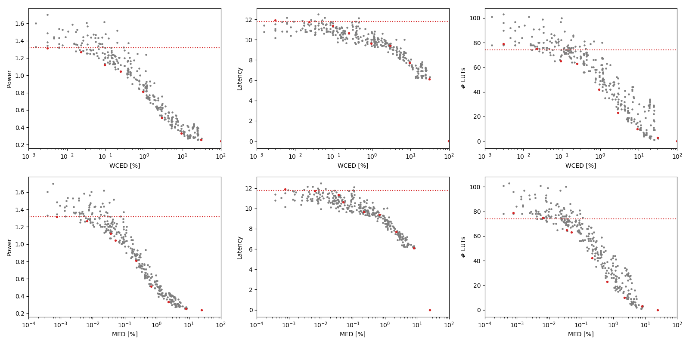

Selected circuits
===================
 - **Circuit**: 8-bit unsigned multipliers
 - **Selection criteria**: pareto optimal sub-set wrt. WCED [%] and Power parameters

Parameters of selected circuits
----------------------------

| Circuit name | MAE% | WCE% | EP% | MRE% | MSE | PowerW | Delayns | LUTs | Download |
| --- |  --- | --- | --- | --- | --- | --- | --- | --- | --- |
| mul8u_1JD3 | 0.00 | 0.00 | 0.00 | 0.00 | 0 | 1.3 | 12 | 74 |  [[Verilog](mul8u_1JD3.v)] [[VerilogPDK45](mul8u_1JD3_pdk45.v)] [[C](mul8u_1JD3.c)] |
| mul8u_50M | 0.00076 | 0.0031 | 25.00 | 0.03 | 1.0 | 1.3 | 12 | 79 |  [[Verilog](mul8u_50M.v)] [[VerilogPDK45](mul8u_50M_pdk45.v)] [[C](mul8u_50M.c)] |
| mul8u_753 | 0.0065 | 0.023 | 64.84 | 0.22 | 35 | 1.3 | 12 | 75 |  [[Verilog](mul8u_753.v)] [[VerilogPDK45](mul8u_753_pdk45.v)] [[C](mul8u_753.c)] |
| mul8u_1G9M | 0.036 | 0.095 | 98.49 | 1.76 | 846 | 1.1 | 11 | 65 |  [[Verilog](mul8u_1G9M.v)] [[VerilogPDK45](mul8u_1G9M_pdk45.v)] [[C](mul8u_1G9M.c)] |
| mul8u_6LH | 0.051 | 0.25 | 84.76 | 1.28 | 2005 | 1.0 | 11 | 63 |  [[Verilog](mul8u_6LH.v)] [[VerilogPDK45](mul8u_6LH_pdk45.v)] [[C](mul8u_6LH.c)] |
| mul8u_18VP | 0.22 | 0.94 | 98.64 | 4.98 | 33225 | 0.81 | 9.6 | 42 |  [[Verilog](mul8u_18VP.v)] [[VerilogPDK45](mul8u_18VP_pdk45.v)] [[C](mul8u_18VP.c)] |
| mul8u_18G6 | 0.66 | 2.93 | 99.03 | 12.00 | 297163 | 0.51 | 9.4 | 23 |  [[Verilog](mul8u_18G6.v)] [[VerilogPDK45](mul8u_18G6_pdk45.v)] [[C](mul8u_18G6.c)] |
| mul8u_17BE | 2.27 | 9.32 | 99.20 | 28.93 | 35240.883e2 | 0.33 | 7.7 | 10 |  [[Verilog](mul8u_17BE.v)] [[VerilogPDK45](mul8u_17BE_pdk45.v)] [[C](mul8u_17BE.c)] |
| mul8u_19BL | 8.08 | 30.81 | 99.21 | 64.52 | 47901.182e3 | 0.26 | 6.1 | 3.0 |  [[Verilog](mul8u_19BL.v)] [[VerilogPDK45](mul8u_19BL_pdk45.v)] [[C](mul8u_19BL.c)] |
| mul8u_199Z | 24.81 | 99.22 | 99.22 | 100.00 | 47164.981e4 | 0.24 | 0 | 0 |  [[Verilog](mul8u_199Z.v)] [[VerilogPDK45](mul8u_199Z_pdk45.v)] [[C](mul8u_199Z.c)] |
    
Parameters
--------------

References
--------------
PRABAKARAN B. S., MRAZEK V., VASICEK Z., SEKANINA L., SHAFIQUE M. ApproxFPGAs: Embracing ASIC-based Approximate Arithmetic Components for FPGA-Based Systems. DAC 2020.

             